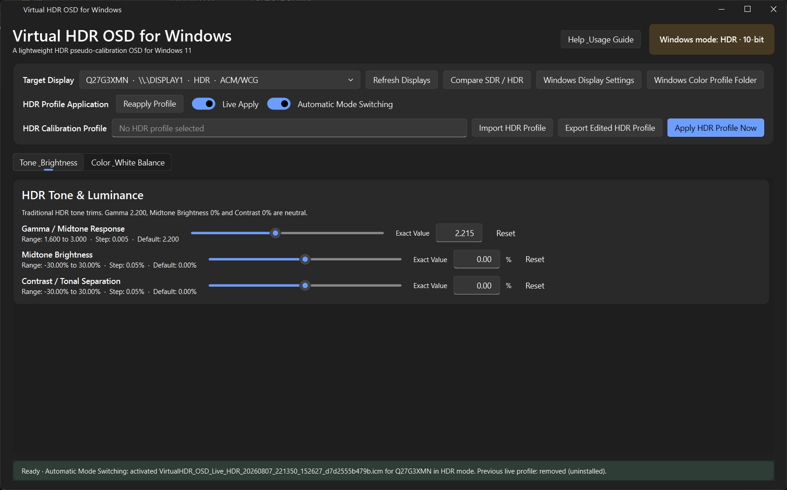
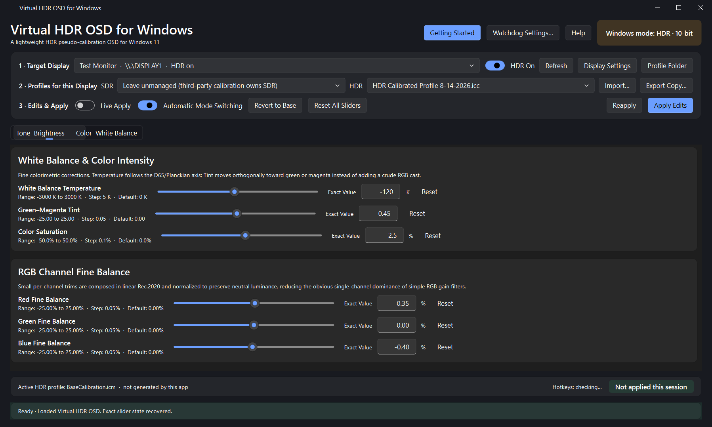

# Virtual HDR OSD for Windows

**Virtual HDR OSD for Windows** is an HDR calibration tool for Windows 11. It measures what a display actually does, adjusts the tone response by eye against calibration patterns, and writes the result into the MHC2 profile Windows applies to that display.





Most HDR monitors lock or substantially reduce access to their physical OSD controls after switching to HDR. White balance, gamma, per-channel RGB balance, saturation, brightness, contrast, and related adjustments may become unavailable or much more limited. Virtual HDR OSD provides a practical **software pseudo-calibration layer** for making small subjective corrections to an existing Windows HDR ICC/ICM profile.

It began as a replacement for those OSD controls, and still does that: correcting a warm or cool cast, reducing a green or magenta bias, or making tonal changes the monitor's HDR menu does not expose.

It now also generates its own calibration patterns. A guided sequence measures black level and peak luminance by the same disappearing-shape method Windows HDR Calibration uses, and writes those figures into the profile's MHC2 header. Sustained full-frame luminance is not among them: the brightness limiter dims a shape and its surround together, so that pattern found the signal's clipping point rather than a luminance. It is read from the panel's EDID instead. A further pattern sets the tone controls against a near-threshold target rather than by impression. Patterns are presented through a Direct3D swapchain in scRGB, so they address absolute luminance across the full ST.2084 range instead of being limited to the SDR white level.

**In addition to the app, a watchdog has been integrated that fixes the bug causing incorrect switching between SDR and HDR profiles in Windows 11. This watchdog is standalone and can be distributed without the app. Feel free to use it. Below is a detailed explanation of how it works.**

> [!NOTE]
> The figures this tool writes come from three places, and they are not equally strong.
>
> **Read from the panel.** Peak, sustained and black luminance, and the display's primaries,
> all come from its EDID. These are what the model was specified at, not your individual
> unit measured, and they do not notice drift -- but they are exact, need no judgement, and
> are the default.
>
> **By eye.** The optional test patterns work the way Windows HDR Calibration does. A
> reading made by eye is genuinely useful, but it is not metrology: it depends on the
> room, on adaptation, and on the observer.
>
> **Measured with an instrument.** The optional colorimeter path measures luminance,
> white balance, and how the display tracks the PQ curve across a 33-point greyscale
> ramp -- the last of which it also corrects. It does not characterise the gamut and
> cannot: the patches are presented in scRGB, so they report the encoding rather than
> the panel. The colour sweeps it measures are reported and never applied, because the
> profile carries a matrix and three per-channel curves, and no such thing can express
> an error that depends on both hue and saturation. A colorimeter also needs a
> spectral correction matched to the panel type, and without one its chromaticity readings
> can be several hundred kelvin out on a quantum-dot display.

---

## About this fork

This is a modified version of **Virtual HDR OSD for Windows 11** by Mixomo:

```text
https://github.com/Mixomo/Virtual-HDR-OSD-for-Windows-11
```

It is distributed under the **GNU General Public License v3.0**, the same licence as the
original. The original project's design intent, safety model and documentation are the
basis for everything here.

### What this fork changes

**Correctness fixes**

- `DISPLAYCONFIG_PATH_TARGET_INFO` was missing the SDK's `modeInfoIdx` member, making the
  struct 44 bytes where Windows writes 48. `QueryDisplayConfig` overran its buffer, and
  every field from the second display onward — including the adapter LUID and target id —
  was read from the wrong offset, so multi-monitor systems addressed the wrong hardware.
- The identity `chad` tag was written with eight values instead of nine, so every generated
  HDR profile carried a malformed chromaticAdaptationTag.
- Applying to one display uninstalled another display's working profiles.
- The base profile chosen by the user was silently replaced by the current Windows default
  on the first apply, so generated profiles carried the wrong colorimetry.
- The standalone watchdog reverted every correction change made in the GUI within about
  five seconds, because it decided solely from the state captured at install time. The
  original project already documented "Off is authoritative"; this fork makes that true.
- Profile filenames, and the records the watchdog reads, were keyed on the adapter LUID,
  which Windows reissues on reboot. Every restart therefore orphaned a working profile in
  the Windows colour folder and left a rival record the watchdog could read instead of the
  current one. Both are now keyed on the monitor's device path.
- A base profile that was truncated or missing a tag was merged tag by tag with the app's
  own synthetic defaults, producing, for example, the display's real red tone curve beside
  linear green and blue. Coupled tag groups are now all-or-nothing.
- Applying skipped the display *association* whenever the generated profile's content was
  unchanged. Installing a profile and associating it are separate operations, and removing
  a profile drops it from the display's association list, so a correction change could
  report success, verify its own read-back, and then be dropped by Windows.
- The base profile was recorded by its ICC description rather than its filename. Windows
  HDR Calibration describes a profile with slashes in the date while naming the file with
  hyphens, so the recorded value was not merely wrong but an invalid path, and everything
  that handed it back to Windows failed silently. Existing settings repair themselves on
  load.
- The watchdog could adopt one of the app's own working profiles as its HDR fallback,
  making it restore already-edited data as though it were the source.
- A watchdog instance that hung during startup kept the singleton lock forever, so every
  healthy instance exited immediately and nothing enforced the user's setting — with no
  log line to show why. Startup is now traced step by step, and an instance that has not
  finished starting within 25 seconds logs the reason and exits so another can take over.

**Behaviour**

- Profiles are chosen per display from dropdowns of what is already installed, rather than
  inferred, and the choices persist across restarts.
- HDR can be switched per display from inside the app.
- Applying compares against what Windows already has and skips redundant reinstalls.
- Slider edits are saved shortly after you stop adjusting, rather than only on apply or on
  a clean exit.

**Hardening**

Every DisplayConfig structure is size-checked against the Windows SDK at import. Neither
`QueryDisplayConfig` nor `DisplayConfigGetDeviceInfo` validates the caller's layout — the
first takes an element count, the second trusts the size in the header — so a wrong struct
is never rejected, it just corrupts memory quietly. That is exactly how the bug above went
unnoticed.

The test suite also refuses to run unless every Windows call that can change the machine's
colour configuration is faked, and fails when a new one is added without being faked. That
guard was written after the tests were found to be calling the real association API against
a fabricated display.

**Divergence from the original's documented behaviour** — see
[Pinning the SDR and HDR profiles](#pinning-the-sdr-and-hdr-profiles). The original states
that automatic mode switching "only attempts to restore the SDR profile that Windows already
had associated with that display." This fork additionally lets you pin a specific SDR
profile. It still never creates, edits or overwrites an SDR profile, and the *Auto* setting
reproduces the original behaviour exactly.

---

---

## Recommended workflow

A profile needs to know what the display can do. There are two ways to supply that, and either
produces a complete profile.

- **Build it from the display itself.** Press **Calibrate Display** in the top bar, or pick
  the first entry in the **HDR** dropdown, *Build from this display's own panel data*. The
  panel's luminance *and* its primaries are read from its EDID, and both go straight into
  the profile. Nothing to download.

  Primaries come from EDID rather than DXGI on purpose. `DXGI_OUTPUT_DESC1` reports
  whatever ICC profile is currently associated, not the panel: on one display it answered
  (0.6746, 0.3144) for red under one profile and (0.6486, 0.3312) under the next, each
  matching that profile's own colorant tags, while the EDID said (0.6836, 0.3047)
  throughout. A profile written from DXGI's answer becomes DXGI's next answer. DXGI is
  kept only as a fallback for a panel whose EDID cannot be read.
- **Start from a profile you already have.** Anything from Microsoft's free **Windows HDR
  Calibration**, or from calibration software such as Calman or DisplayCAL, works as the base.

The second is worth preferring when the profile was made with a meter, because a measurement
describes your individual unit where the panel's own figures describe the model. Everything else
runs inside the app: HDR is switched from the top bar, and both profiles are chosen from dropdowns
of what is already installed -- no round trip through Windows Settings, no import/restart cycle.

> [!TIP]
> The **Getting Started** button in the top bar walks you through this entire
> sequence one step at a time, and checks your progress as it goes: it tells you
> whether HDR is actually active, whether a base profile has been imported, and
> whether Live Apply is on. It opens automatically the first time you run the app.

1. Start Virtual HDR OSD for Windows.
2. Select the correct monitor under **1 · Target Display** and switch **HDR On** next to it.
3. In **2 · Profiles for this Display**, choose where the colour data comes from: the
   *Build from this display's own panel data* entry, or an installed profile of your own.
4. Set the **SDR** dropdown (see below). If another program calibrates your SDR, choose *Leave unmanaged*.
5. Use **Import…** only for a file that is not installed in the Windows colour folder.
6. Enable **Live Apply** if you want every adjustment to be reflected on the display automatically.
7. Make small tonal and color corrections. **Reset Sliders** returns everything to neutral, and **Revert** reloads the base profile untouched.
8. Flip the **HDR** switch in row 1 off and on when you want to compare white balance, overall color appearance, and perceived brightness against the SDR desktop.
9. Press **Apply Edits** to install and associate the result.
10. Turn on **Lock Profile** so Windows cannot drop the association on the next mode change.
11. Use **Export Copy…** to save a backup.

Virtual HDR OSD is best treated as the final fine-adjustment stage. A profile built from the
panel's own reported figures is a sound starting point, but those figures describe the model as
specified, not the unit in front of you; a meter-made base still measures better.

---

# Installation

## Install the compiled portable .exe from Releases page

The easiest way to install it is to go to the “Releases” section of this repository and download the attached .exe file. It's portable and contains the entire app. 

## Run from source

The source edition uses a self-contained Python/uv environment. Python, uv, and the virtual environment remain inside the project directory and do not require a system-wide Python installation.

Clone the repository or download it as a ZIP, then run:

```text
1- Install & Run.bat
```

On first launch the script prepares the project-local runtime. Subsequent launches reuse it.

## Build the single portable EXE (advanced usera & developers)

Run:

```text
3- (Advanced users & developers) - Build Portable EXE.bat
```

The builder creates only the portable one-file release:

```text
release\
├─ Virtual HDR OSD for Windows.exe
└─ Virtual HDR OSD for Windows.sha256.txt
```

The resulting EXE contains the Python/Qt application runtime and does not require Python, uv, the source tree, or the development virtual environment on the destination PC.

The builder intentionally does **not** create a second standalone-folder distribution. It first runs the project's tests, then builds the GUI with Nuitka in one-file mode and disables the console window.

---

# Interface overview

The top bar is numbered. **Calibrate Display**, above it, writes a profile and makes it the
Windows default on its own; everything else that writes to your Windows colour
configuration lives at the right-hand end of row 3:

- **1 · Target Display** — selects the display, and turns its HDR on or off without leaving the app.
- **2 · Profiles for this Display** — pins which installed profile is this display's SDR profile and which HDR profile the sliders edit. Remembered per monitor, across restarts.
- **3 · Edits & Apply** — Live Apply, automatic mode switching, and edit management on the left; the two buttons on the right are the ones that write to Windows.

Below that:

- **Tone & Brightness** — fine tonal controls, plus the **SDR-in-HDR Gamma Correction** dropdown (optional Windows piecewise-sRGB → pure gamma 2.2 correction, with automatic SDR-white readback and global hotkeys).
- **Color & White Balance** — white-point, chroma, and RGB fine adjustments.
- **Getting Started** — the step-by-step walkthrough, with live progress checks.
- **Measure…** — measures the display with a colorimeter instead of by eye.
  Needs ArgyllCMS installed separately; see *Measuring with a colorimeter* below.
- **Lock Profile** — the switch in row 3. Installs the independent association watchdog, which
  puts the HDR profile back whenever Windows drops it, and keeps Alt+1 / Alt+2 working with the GUI
  closed. It reports whether the watchdog is actually running rather than what was last clicked, so a
  cancelled or failed install leaves it off rather than lying about it. The installer needs no
  administrator rights; if Windows refuses its scheduled task it says so and uses a plain startup
  entry instead.
- **Watchdog…** — the same install/remove actions with a fuller explanation, and the only
  way to force a reinstall while the watchdog is already running.
- **Help** — the full usage guide, control reference, and recovery notes.

Two bars run along the bottom:

- **Activity bar** — the HDR profile Windows currently has associated, whether this window owns the Alt+1 / Alt+2 hotkeys, and whether your sliders differ from what is installed.
- **Status** — reports profile operations, mode changes, and errors.

Almost every interactive control has a tooltip. Hover over a button, switch, slider, numeric field, or status element for a concise explanation.

## Pinning the SDR and HDR profiles

Row 2 lists every ICC/ICM profile installed on the PC, so both choices are made
in the app rather than through Windows' colour management dialogs.

**HDR** selects the profile the sliders edit. Choosing one loads it as the base
immediately — no import, no restart, no reapplying your settings afterwards. The
app's own working profiles are deliberately excluded from this list, so edits can
never compound on already-edited data.

**SDR** decides what happens when Windows drops back to SDR:

| Setting | Behaviour |
|---|---|
| *Auto* (default) | Restores whatever profile Windows had associated when the app last observed it. |
| *Leave unmanaged* | The app never touches the SDR association at all. |
| A specific profile | That profile is restored on every HDR → SDR transition. |

Both choices are stored per monitor and survive restarts. They are keyed on the
monitor's device path rather than its adapter LUID, because Windows reissues
adapter LUIDs on reboot — anything keyed on those would be lost every restart.

> [!NOTE]
> **Known limitation.** The device path includes the port the monitor is plugged
> into, so moving a display to a different output makes Windows report it as a new
> device. Its pinned SDR and HDR choices will not follow, and its working profile
> pair is regenerated under a new name — the old pair is reclaimed automatically,
> so nothing accumulates, but the two dropdowns need setting again. Re-run the
> watchdog installer afterwards, as the original project already advises after any
> monitor or GPU topology change.

> [!NOTE]
> **This is the one place this fork goes beyond the original project's documented
> behaviour.** The original restores only the SDR profile Windows already had associated;
> pinning lets you nominate a different installed profile instead.
>
> What has not changed: no SDR profile is ever created, edited or overwritten — only the
> *association* is set, and only to a profile already installed in the Windows colour
> folder. The association is touched at exactly one moment, an HDR → SDR transition with
> Automatic Mode Switching enabled, and never when you pick something from the dropdown.
> Choosing **Auto** reproduces the original behaviour exactly, and **Leave unmanaged**
> is stricter than the original.

> [!IMPORTANT]
> **If another program calibrates your SDR** — Calman, DisplayCAL, i1Profiler and
> the like — which setting to use depends on what that program actually installed.
>
> Open its profile from the Windows colour folder and look for a **`vcgt`** tag.
>
> - **`vcgt` present.** The calibration lives in a 1D LUT that a resident loader
>   pushes into the GPU. Choose *Leave unmanaged*: a second program re-associating
>   profiles behind that loader's back is how calibration silently breaks. Note
>   that restoring an ICC association does **not** reload a VCGT — that is the
>   loader's job, never this app's.
> - **No `vcgt`.** The profile is a pure characterisation, which is what you get
>   when the calibration was written into the monitor's own hardware LUT. Nothing
>   is loading anything at runtime, so there is no loader to conflict with, and
>   *pinning that profile* is the more reliable choice: it guarantees the
>   association comes back after an HDR → SDR switch.
>
> Either way, and on *Auto* too, the app reads what Windows already has and skips
> the write when it matches, so it never re-asserts an association needlessly.

## Knowing what is actually applied

The activity bar answers the two questions that are otherwise invisible:

- **Active HDR profile** is read back from Windows, not from what the app last
  wrote. If a previous session or the watchdog left a different variant
  associated, that is what you will see. The correction status shown next to it
  is derived from the active filename, so it cannot contradict reality.
- **Unapplied edits** appears only once you have changed a slider since the last
  apply. A freshly opened window shows *Not applied this session* instead, which
  is a different thing. The **Apply Edits** button gains a `•` marker whenever
  there is something to apply.

---

# Target Display

## Target Display

Selects the physical Windows display that Virtual HDR OSD will monitor and edit.

HDR state and profile associations are tracked per display. On multi-monitor systems, always confirm that the intended HDR monitor is selected before importing or applying a profile.

## Windows mode indicator

The status badge reports the mode currently detected for the selected display:

```text
Windows mode: HDR
```

or:

```text
Windows mode: SDR
```

The application is an HDR editor. SDR is exposed primarily so that the user can compare modes and so that profile associations can be handled safely during an SDR/HDR transition.

## Refresh

Rescans the active Windows display topology.

Use this after:

- connecting or disconnecting a monitor;
- changing display topology;
- changing GPU/display routing;
- waking a display that was unavailable;
- Windows fails to show the expected monitor.

## HDR switch

Turns Windows HDR on or off for the display selected in the same row.

This targets that specific display, unlike `Win + Alt + B`, which only ever
toggles whichever display Windows currently considers the active one — on a
multi-monitor system the shortcut frequently switches the wrong panel. Flipping
this switch is also the quickest way to compare the HDR result against SDR.

Virtual HDR OSD does **not** create an SDR profile. On an HDR → SDR transition it
only restores the SDR profile you pinned in row 2, or the one Windows already had,
and does nothing at all when SDR is set to *Leave unmanaged*.

## Display Settings

Opens the main Windows display settings page.

Use it for Windows-level display configuration that is intentionally outside the scope of Virtual HDR OSD.

## Profile Folder

Opens the Windows system color-profile directory, normally:

```text
C:\Windows\System32\spool\drivers\color
```

This is where installed ICC/ICM profiles are normally stored.

---

### Stable working-profile model

Virtual HDR OSD never edits or overwrites the user's original Windows HDR Calibration profile. When HDR becomes active, the application reads the **currently selected Windows HDR profile** and treats it as the immutable base for the editing session. It then maintains at most two app-owned working profiles for that display:

```text
Virtual_HDR_OSD_<display>_Off.icm
Virtual_HDR_OSD_<display>_On.icm
```

The names are stable and reused. Slider changes, Live Apply, gamma-correction changes, and SDR/HDR transitions replace these working copies instead of creating timestamped profiles. The original HDR profile remains the source and safe fallback.

# Apply to Windows

This section controls when the edited HDR profile is generated, associated, and reapplied.

## Reapply

Forces a full reinstall of the current settings, bypassing the change detection
described below.

This is useful when:

- Windows appears to have dropped the expected HDR association;
- you have just changed SDR/HDR mode;
- the display or graphics driver was reset;
- you want to explicitly force the current settings back onto Windows.

It does not reset any sliders.

### Change detection

Applying does not blindly reinstall. Before touching Windows, the application
compares the profile it just generated against the copy already installed in the
Windows colour directory, ignoring the ICC creation timestamp so that identical
settings compare equal at any time of day.

If they match, nothing is uninstalled, rewritten, or reinstalled — only the
default association is set. The practical consequences:

- Toggling the SDR-in-HDR correction with **Alt+1** / **Alt+2** is a single
  association call, because the *Correction Off* and *Correction On* profiles are
  both already installed. Neither is regenerated.
- Pressing **Apply Edits** with nothing changed is close to free.
- Live Apply only pays the reinstall cost for edits that genuinely alter the
  profile.

**Reapply** exists precisely for the case where the installed bytes are correct
but the *association* has been lost, which change detection cannot see.

## Live Apply

When enabled, slider changes are automatically converted into an updated HDR profile and applied after a short debounce.

This creates an OSD-like workflow: move a control and observe the display.

When disabled, adjustments remain in the editor until the profile is explicitly applied.

For careful visual matching, **Live Apply** is usually the most convenient mode.

## Automatic Mode Switching

Combines mode tracking and profile recovery into one user-facing option.

When enabled:

### HDR → SDR

Virtual HDR OSD waits briefly for Windows to complete the mode transition and restores the SDR `STANDARD` profile that Windows previously had associated with that display.

If there was no SDR profile, the application does nothing.

### SDR → HDR

After Windows completes the transition back to HDR, Virtual HDR OSD reapplies the active HDR profile.

This is intended to reduce profile-association problems around repeated `Win + Alt + B` transitions.

---

# Profiles for this Display

## SDR and HDR pickers

Two dropdowns listing every colour profile installed on the PC. See
[Pinning the SDR and HDR profiles](#pinning-the-sdr-and-hdr-profiles) above for
what each setting does. Hover the HDR picker to see the full path of the profile
currently loaded as the editable base.

## Import…

Loads an `.icm` or `.icc` HDR profile.

The file picker opens directly in the Windows color-profile directory for convenience.

The recommended source is a profile generated by **Windows HDR Calibration**.

When a profile generated by Virtual HDR OSD is imported again, the application can recover its embedded editor state and restore the corresponding slider values.

Importing a profile does not mean that every arbitrary third-party ICC parameter can be losslessly translated into the application's slider model. The controls represent Virtual HDR OSD's correction layer.

## Export Copy…

Writes the current edited HDR profile to an `.icm` or `.icc` file. It does not
install anything or change any association.

Use this once the desired appearance has been reached. Because the exported file
embeds your exact slider positions, re-importing it restores them precisely,
which makes an export a reliable backup before experimenting further.

## Revert

Discards your slider edits and reloads the base profile you imported, exactly as
it is on disk. Asks for confirmation first, and cannot be undone.

Use it when a session of adjustments has drifted somewhere you do not want, and
you would rather restart from the Windows HDR Calibration result than try to
reverse each control.

## Reset Sliders

Returns every control to its neutral default, keeping the loaded base profile.
Asks for confirmation first, and cannot be undone.

The difference from **Revert**: this neutralises your correction layer
while leaving the base profile selected, whereas Revert re-reads the file and
restores whatever slider state that file implies.

Neither button changes anything in Windows on its own — apply afterwards if you
want the result installed.

## Apply Edits

Generates the current HDR profile, installs/associates it for the selected display, and applies it immediately.

Use this when **Live Apply** is disabled or whenever an explicit final application is desired.

> [!NOTE]
> **Apply Edits** applies the sliders exactly as they currently stand. It does not
> re-read the profile selected in the HDR picker, so clicking it can never
> silently discard adjustments you have just made. To deliberately go back to the
> file on disk, use **Revert**.

If Windows is not in HDR mode for the selected display, applying is refused with
an explanatory message rather than silently doing nothing.

---

# SDR-in-HDR Gamma Correction

Virtual HDR OSD optionally integrates the method documented by Dylan Raga in:

```text
https://github.com/dylanraga/win11hdr-srgb-to-gamma2.2-icm
```

Windows 11 normally represents ordinary SDR content inside the HDR desktop using the **piecewise sRGB transfer function**. A great deal of PC content was authored or visually tuned on displays behaving closer to a pure gamma 2.2 response, which can make SDR-in-HDR shadows appear more raised or washed out than expected.

The optional correction follows the upstream transform direction:

```text
PQ input
   ↓
ST 2084 EOTF → absolute luminance
   ↓
normalize against Windows SDR reference white
   ↓
piecewise-sRGB signal value
   ↓
interpret through pure gamma 2.2
   ↓
absolute luminance
   ↓
ST 2084 inverse EOTF
```

Values above diffuse SDR white are left untouched by the correction layer. The application's normal **Gamma / Midtone Response** slider remains a separate traditional tone trim and is not reversed or repurposed by this feature.

## Correction dropdown

The dropdown contains:

- **Off** — no SDR-in-HDR curve correction.
- **Auto (Recommended)** — reads the selected HDR display's current Windows SDR reference white internally using DisplayConfig and generates the correction from that value.
- **100 nits / Brightness 5** — upstream published mapping for Windows SDR Content Brightness 5.
- **200 nits / Brightness 30** — upstream published mapping for Windows SDR Content Brightness 30.
- **300 nits / Brightness 55** — upstream published mapping for Windows SDR Content Brightness 55.
- **400 nits / Brightness 80** — upstream published mapping for Windows SDR Content Brightness 80.

`Auto` is the recommended choice because it avoids manually duplicating the Windows setting and can use the actual current reference-white value while the GUI is running.

Two entries from the upstream download list, `Unspecified` and `SDR`, are no longer offered.
They were filenames rather than settings anyone would choose. A saved profile or state file
naming one still resolves to the same basis it was built with — 200 and 80 nits
respectively — so nothing already generated changes behaviour.

The correction's target gamma comes from the **Gamma / Midtone Response** slider rather
than being fixed at 2.2. Above diffuse SDR white the correction is exact identity at every
setting.

## Important limitation: native HDR content

This is a **display-wide MHC2 correction**. Windows does not provide a clean public mechanism for an ICC/MHC2 display calibration to affect only SDR windows while automatically bypassing native HDR10, YouTube HDR, RTX HDR, or another HDR swap chain on the same desktop.

Consequently, the upstream method can also darken shadows in genuine HDR content. Use the hotkeys when moving between desktop/SDR-in-HDR content and native HDR content:

```text
Alt + 1    Disable SDR-in-HDR gamma correction
Alt + 2    Re-enable the selected correction
```

While Virtual HDR OSD is open, the GUI registers these hotkeys when they are free. If the standalone watchdog is already running, it owns the same global hotkeys and the GUI synchronizes its dropdown/state through the shared runtime state instead of competing for duplicate registrations. The watchdog keeps the hotkeys available after the GUI closes.

Because a hotkey chord can only belong to one process at a time, registration
legitimately fails in that situation. The activity bar therefore reports which
side owns them:

```text
Hotkeys: Alt+1 / Alt+2 active          this window handles them
Hotkeys: not owned by this window      the watchdog, or another app, handles them
```

Hover the indicator for the specific reason. If registration failed for a reason
other than the watchdog — another application claimed `Alt+1` first, for example —
the status bar says so explicitly rather than leaving the keys silently dead.

**Off is authoritative:** choosing `Off` (or pressing `Alt + 1`) immediately applies an uncorrected companion profile. The internal mode watchdog and the standalone watchdog are forbidden from restoring a previously corrected profile while the shared correction state is Off. `Alt + 2` is the only hotkey that re-enables the selected correction.

### Which side wins

Two processes can change the correction: this app, and the standalone watchdog. Both
record when they last acted — the app in `gamma_hotkeys.json`, the watchdog in its own
`State.json` — and **the more recent decision wins**.

That comparison is what makes the guarantee above real. The watchdog re-asserts the HDR
association every few seconds, and it used to decide purely from the state it captured when
it was installed. A correction change made in the GUI was therefore undone within about five
seconds, permanently and with no explanation, while the dropdown still showed the user's
choice. The watchdog now honours whichever intent is newer, and prefers the profile
filenames the app most recently published, so a pair regenerated under new names (which
happens when the adapter LUID changes) is still followed.

If the app is closed, or its runtime file is missing or unreadable, the watchdog falls back
to its own captured state exactly as before.

While the GUI is open, **Auto** reads the current Windows SDR white level and regenerates the correction from that value. The app maintains only two fixed per-display working profiles: **Correction Off** and **Correction On**. Their filenames are reused rather than timestamped, so repeated Live Apply operations or SDR/HDR transitions do not accumulate new profiles in Windows. After the GUI closes, the standalone watchdog switches between those last prepared Off/On working profiles with Alt+1 and Alt+2.

---

# Measuring with a colorimeter

Everything the app can work out on its own is *declared* rather than measured: the EDID
carries the luminance and the primaries the panel's model was specified at. That is not
your individual unit measured, and it does not notice that a panel drifts. A colorimeter
closes part of that gap -- luminance, white balance and greyscale tracking, but not
the gamut; see below.

## What you need

**ArgyllCMS**, from [argyllcms.com/downloadwin.html](https://www.argyllcms.com/downloadwin.html).
Download the **executable** distribution, not the source, and unzip it somewhere without
spaces in the path -- Argyll's own documentation warns against Program Files for that
reason. `D:\Argyll` is a good choice. Point the app at the `bin` directory inside it, or
put that directory on your PATH.

Argyll is run as a separate program, never copied into this project. That keeps its
licence at arm's length, and means its maintained instrument code does the colour
matching rather than a reimplementation of it here.

## Drivers

Most likely none. Instruments in the i1Display 3 family -- i1Display Pro, ColorMunki
Display, and the Calibrite ColorChecker Display range -- enumerate as USB HID devices and
work on the driver Windows already has. Argyll's warning about installing its libusb
driver, and about that driver replacing the manufacturer's, applies only to non-HID
instruments.

Where no driver change is needed, other calibration software keeps working exactly as
before. Only one program can hold the instrument open at a time, so close the other one
before measuring.

## Running a measurement

**Measure…** in row 3. The display must be in HDR, because the patches are
shown in absolute luminance. The first time, you will be asked where ArgyllCMS is; the
answer is remembered per machine.

Before anything happens you are told how many patches there are, roughly how long it
takes, and that Esc stops it. That is deliberate: once the run starts the screen is black
with a single patch on it and nothing else, because any text on the frame is light the
meter would read along with the patch. Esc cancels at any point -- a cancelled run
changes nothing at all.

A green target appears first, exactly where the patches will be. Put the meter flat on
the glass inside it; the app reads the target until it sees green at a plausible
brightness, so it can tell you the meter is in place rather than leaving you to guess.
Press Enter to start once it is.

The run is a Calman-style sweep: the six patches the profile is built from, then a
33-point greyscale ramp spaced evenly in PQ, then five saturations of each of the six
hues. About four minutes in total. The ramp is dense at the bottom on purpose -- in HDR
the bottom two stops are where a 5% step in signal is an enormous step in luminance, and
where most displays go wrong.

When it finishes, the measured peak, black and white balance replace what the profile
had, and the greyscale ramp is turned into the three per-channel curves the profile
carries. Those do two things a single set of RGB trims cannot: they make a code deliver
the luminance ST.2084 says it means, all the way up the range, and they hold grey to the
reference white at every level rather than only at the one the trims were solved at.
Above the measured peak nothing is corrected -- the display is rolling off there by rules
that were not measured, and replacing that with a hard clip would be worse than leaving
it alone -- so the correction fades out between the measured peak and the top of the
range. The primaries are deliberately left alone: the patches are presented in scRGB, which is
defined on BT.709, so a measured "red" is BT.709 red as the display renders it rather than
the display's own primary. On a P3 panel whose native green is (0.2698, 0.6859) the green
patch read (0.3141, 0.5892) -- 0.0141 from BT.709 and 0.0967 from the panel. Those readings
are exactly right for white balance, which acts on the signal this app sends, and useless
as a description of the gamut. Press **Apply Edits** to write the result out.

## Displays whose channels do not add up

The white balance used to be solved from red plus green plus blue equalling the white
measured beside them, and refused when they did not. Some displays never satisfy that. A
QD-OLED measured here reads its saturated primaries far brighter than their share of
white -- 2.30x, 2.26x and 2.04x for red, green and blue -- so the three sum to 2.11 times
the white patch. It is repeatable to within 1% across consecutive readings, identical on
both of the instrument's calibration tables, and not a brightness limiter: a yellow patch
at 213 nits is unaffected while cyan at a predicted 176 is not. It weakens as level rises
-- 111% additivity error at 100 nits, 82% at 200, 17% at 300 -- but on this panel there is
no level where it comes inside the 8% the old check allowed.

That is now solved rather than refused. The primaries' *chromaticities* are steady and
close to the BT.709 the patches ask for, so the direction of each channel survives even
though its magnitude does not. Only the magnitudes are rebuilt, from the one patch a
saturated-colour boost cannot touch: white. Solving for the three luminances that make
the measured white out of the measured primary directions gives contributions that add up
to it by construction, and a white balance solved through those needs no additivity
assumption at all.

On the panel above that recovers **R -20.9%, G 0.0%, B -0.4%** -- within half a percent of
what the same display returned on the rare runs that did satisfy the old check. On a
display whose channels do add up, the solve returns exactly the luminances that were
measured, so nothing changes. The run reports the departure, because a display doing this
is worth knowing about; it no longer refuses over it.

What is still refused is a set where the three channels are the same colour, or where the
white sits outside the triangle its own primaries make. Neither is a display being
unusual -- both mean a patch was misread, and no amount of solving recovers three
directions from one.

## When the display gets dimmer as you ask for more

A curve corrects a display by reversing its response, and a response that goes backwards
cannot be reversed -- there is no single drive that produces a level the display reaches
twice. Measured on a PG32UCDM in one of its HDR presets: asked for 47.5 nits it emitted
106.6, and asked for 58.5 it emitted 61.9. Everything below about 50 nits came out at
roughly 2.2x what was asked for, then dropped back to correct.

That was the monitor, not the profile and not the instrument. The LUT in the applied
profile is smooth and near-identity across the whole region; three of the instrument's
integration modes give the same numbers to three significant figures; and 10% and 25%
windows put the step in the same place, so it is not driven by average picture level
either. **It is a property of the monitor's HDR mode**, and changing that mode removed it
completely -- the ramp became monotonic and the additivity error fell from 111% to
around 1-3%. Two different presets on the same panel both measured clean afterwards, so
this is not about finding one blessed mode: it is about the run being able to tell you
that the one you are on is not calibratable.

So the app measures the reversal, refuses to build a curve from it, and says which
setting to go and change. An inverse built from a running maximum does not fail on a
ramp like that; it flattens the reversal and produces a curve that is wrong across
exactly the range the ramp puts most of its points in. That is worth refusing loudly.

**EOTF tracking is unaffected by a refused white balance.** The ramp is neutral patches whose luminance is
read directly. Per-level grey *balance* is approximate on a display that boosts saturated
colour, because it is apportioned through those same primaries: the drift it reports is
real, but the target it is held to inherits the spread between those factors.

## Measuring more than once

The white balance trims are folded into the correction already applied rather than
replacing it, because a measurement describes the display *as currently corrected*. That
makes a second run a verification: a calibration that worked re-measures as neutral,
leaves the correction untouched and reports "verified", while one that fell short
tightens and converges.

The greyscale curves work the other way round, and deliberately. Each ramp point is
paired with the code that was actually sent for it -- after whatever curve was already in
force -- so what is stored describes the panel itself rather than the correction sitting
on top of it. A later run therefore *replaces* it instead of stacking on it, which is
what stops two passes doubling a correction that only needed applying once. Measured
against a simulated display, one pass takes a 17% luminance error to 0.1%, and three
further passes leave it there.

It also means the correction in force has to still be valid. **If you change anything on
the monitor -- picture mode, colour temperature, brightness, HDR mode -- press Reset
Sliders before measuring again.** Reset Sliders asks separately about the measured
greyscale correction, and keeps it unless you say otherwise; after a change to the
monitor itself, discard it. The old correction was solved for a display that no
longer exists, and folding a new measurement into it gives a result that describes
neither. Reset, rebuild from the panel, apply, then measure.

## What gets measured

Six patches, each shown in the same centred window covering a tenth of the screen, on
black. Holding the window size constant matters on an emissive panel, where the
brightness limiter responds to total output and a full-screen patch would not measure the
same thing as a small one.

| Patch | What it establishes |
|---|---|
| Black | The panel's real black floor, and with peak white its contrast |
| Peak white | Actual peak luminance, at the window size stated beside it |
| Reference white, red, green, blue | The white balance correction, shown at 100 nits so the brightness limiter is not engaged |

Black is measured first, while the panel is still cool: a long bright sequence warms an
emissive display, and the black floor is the reading most disturbed by that.

## When a reading is refused

A meter that is unplugged, aimed at the wrong part of the screen, or reading through a
closed diffuser does not fail -- it returns numbers. Those numbers would reach the profile
as peak luminance and display primaries, where nothing afterwards could tell them from
real measurements.

So a set of readings is checked for things that are physically impossible rather than
merely surprising, and refused outright if any of them hold: a peak outside 40-10,000
nits, a black that is more than 2% of white, a chromaticity outside the xy plane, or three
primaries spanning a gamut larger than BT.2020 or narrower than a tenth of sRGB. A
surprising reading may well be the panel; an impossible one is not.

A failed patch ends the run rather than being skipped. Primaries measured without their
matching white are not comparable with each other, and a peak carried over from an earlier
attempt is not a measurement of anything.

## The first failure you are likely to see

> The meter's sensor is in the wrong position. Slide the ambient filter off the lens.

i1d3-family instruments have a rotating ambient diffuser that has to be moved off the lens
before they can read a screen. With it closed, `spotread` retries forever rather than
giving up -- 46 MB of the same complaint in 200 seconds during development -- so the app
stops at the first occurrence and says what to do about it.

---

# Calibration patterns

**Test Patterns…** in row 3 fills the display with calibration patterns. The screen becomes
a measuring instrument while it is open: black everywhere except a window covering a tenth
of the screen area, with guidance held at 12 nits against one edge.

The window matters. On an emissive panel a full-screen pattern engages the brightness
limiter in proportion to how bright the pattern is, so a dark pattern and a bright one are
measured under different conditions and two readings minutes apart are not comparable.
Every pattern is confined to the same window area to hold that still. Maximum full-frame
luminance is the sole exception, because filling the screen is what that figure means.

Patterns are rendered in scRGB through a Direct3D 11 flip-model swapchain and specified in
absolute nits. On an HDR output scRGB 1.0 is 80 nits, so a level maps directly and patterns
reach the full ST.2084 range. On an SDR output 1.0 is that display's reference white,
absolute luminance is not addressable, and levels are shown as a ratio instead — the view
says which of the two applies rather than implying precision it does not have.

Frames are built in device pixels. Qt reports logical units, so on a 125% display a
fullscreen widget reports 3206x1803 for a 3840x2160 client area; presenting at the smaller
figure makes the compositor stretch every frame, which resamples the gamma-match lines and
destroys the property that pattern depends on.

## The guided run

The view opens on a 3-step sequence and states which step it is on.

| step | what it measures | how |
| --- | --- | --- |
| Black level | minimum luminance | lower a shape until it disappears |
| Peak white | peak luminance | raise a shape until it stops separating from its surround |
| Full-frame white | maximum full-frame luminance | the same, with the whole screen lit |
| Tone tracking | nothing — sets Gamma, Midtone Brightness and Contrast | |

The first three move the *pattern* rather than the display. Nobody can say what luminance a
patch is, but anybody can say whether a shape is visible, so the level at which it
disappears is the reading. This is how Windows HDR Calibration works, and it means the same
patterns can later be driven by a meter.

`Enter` records a reading and advances. On the last step it opens the results, where `Enter`
writes all three into the profile's MHC2 header and `lumi` tag. Leaving without applying
does not lose them: each is written into the editor as it is taken, and the next Apply Edits
writes them out.

## Reading a clipping point

Peak and full-frame both find the level at which the display stops separating two adjacent
values. That is a clipping point, not a photometric measurement, and on a display with
fixed tone mapping the two land close together — the curve that clips does not move with
window size. An emissive panel sustains far less than its peak across a whole screen, so
readings that match indicate signal handling rather than brightness. A meter reads lower.
An HGIG or tone-mapping-off mode in the monitor's own menu separates the two.

## Controls

| key | action |
| --- | --- |
| `1`–`9`, `0` | select a pattern directly |
| `Tab` | next control |
| `←` `→` | adjust the selected control, or move the level on a threshold pattern |
| `↑` `↓` | walk the levels of a stepped pattern |
| `E` | type an exact value |
| `Enter` | record, advance, or apply on the results screen |
| `S` | return to the results after browsing |
| `H` | move the guidance panel to the other edge |
| `Esc` | leave |

Each control also draws a track showing where its value sits in range, draggable with the
mouse. The probe track is positioned in PQ, not nits: a linear bar would spend almost its
entire length on highlights and show no movement through the range where thresholds are
found. The cursor is black with a grey outline so it adds no meaningful light to the screen.

Live Apply is switched on for as long as the view is open and restored as it was on exit.
Without it the tone controls would move sliders that rebuilt nothing.

## The other patterns

Grey staircase, shadow ladder, neutral ramp, colour patches and solid patch are reached by
number key. Each states what correct looks like. Gamma match reads the transfer function
directly by comparing a solid patch against interleaved single-pixel lines, but needs about
two metres of viewing distance before the lines blend, so it is not part of the guided run.

---

# Tone & Brightness

The tone controls are intentionally independent from the Windows **SDR content brightness** setting. Virtual HDR OSD does not expose or modify that Windows slider.

The controls operate on the generated HDR profile.

## Gamma / Midtone Response

**Default:** `2.200`  
**Range:** `1.600 – 3.000`  
**Step:** `0.005`  
**Pattern:** Tone tracking, or Gamma match from a distance

Adjusts the power-law midtone response.

- `2.200` is the neutral reference used by the editor.
- Lower values brighten the midtone response.
- Higher values darken the midtone response.

Because the step is only `0.005`, subtle changes such as `2.200 → 2.205` are possible.

**With the SDR-in-HDR correction on, this sets the correction's target gamma** rather than
applying a second curve on top of it. That distinction is not cosmetic. The correction's
defining property is that everything above diffuse SDR white is left at exact identity,
because native HDR content lives there and does not want the correction; a separate power
applied afterwards lifts that range too. At `2.000` it put diffuse white 32% high and
1000-nit highlights 20% high, so moving one slider silently rebrightened HDR content the
correction never touches. Folded in, identity holds at every slider position.

With the correction off there is nothing to fold a target into, and it behaves as a plain
independent power.

## Midtone Brightness

**Default:** `0.00%`  
**Range:** `-30.00% – +30.00%`  
**Step:** `0.05%`

Raises or lowers perceived midtone brightness while keeping the black and peak-white endpoints anchored.

Use this when the overall middle of the HDR image appears too dark or too bright but you do not want a simple global offset that moves the endpoints.

This is different from Gamma:

- **Gamma** reshapes the tonal response.
- **Midtone Brightness** biases the middle of the response while retaining the endpoints.

## Contrast / Tonal Separation

**Default:** `0.00%`  
**Range:** `-30.00% – +30.00%`  
**Step:** `0.05%`

Controls tonal separation around the midrange.

Positive values increase perceived separation between nearby tonal levels. Negative values reduce it.

Black and peak-white endpoints remain anchored.

Use small values first. Large contrast changes can make an otherwise well-calibrated HDR profile look unnatural.

---

# Color & White Balance

The color engine is designed for fine correction rather than crude RGB tinting.

Temperature, Tint, RGB balance, and Saturation are composed as colorimetric transformations rather than simple screen overlays.

---

## White Balance Temperature

**Default:** `0 K`  
**Range:** `-3000 K – +3000 K`  
**Step:** `5 K`

Applies a fine white-point offset around the profile's neutral reference.

- Positive values make the image warmer.
- Negative values make the image cooler.

The implementation uses a white-point adaptation rather than simply adding red or blue. This produces a smoother and more useful transition for visual white-balance matching.

A typical workflow is to adjust Temperature first, then use Tint for the remaining green/magenta error.

---

## Green–Magenta Tint

**Default:** `0.00`  
**Range:** `-25.00 – +25.00`  
**Step:** `0.05`

Corrects the white point along the green/magenta direction.

Tint is designed to complement Temperature rather than duplicate it. Its correction direction is derived independently from the primary warm/cool temperature axis.

Use it when the image is approximately the correct warmth but still appears slightly green or magenta.

---

## Color Saturation

**Default:** `0.0%`  
**Range:** `-50.0% – +50.0%`  
**Step:** `0.1%`

Adjusts global chroma intensity.

- Negative values reduce saturation.
- Positive values increase saturation.
- `0%` leaves saturation neutral.

The saturation transform is designed to preserve luminance more effectively than naïvely multiplying RGB channels.

For calibration-oriented use, very small changes are recommended.

---

# RGB Channel Fine Balance

The individual RGB controls are intended as the final stage after Temperature and Tint.

They are composed in linear Rec.2020 and normalized to reduce unintended luminance shifts. This makes them more suitable for precise residual corrections than simple independent channel multipliers.

## Red Fine Balance

**Default:** `0.00%`  
**Range:** `-25.00% – +25.00%`  
**Step:** `0.05%`

Fine adjustment of the red channel.

Useful for residual red/cyan imbalance after the broader white-balance controls have already been adjusted.

## Green Fine Balance

**Default:** `0.00%`  
**Range:** `-25.00% – +25.00%`  
**Step:** `0.05%`

Fine adjustment of the green channel.

Useful for residual green/magenta imbalance.

## Blue Fine Balance

**Default:** `0.00%`  
**Range:** `-25.00% – +25.00%`  
**Step:** `0.05%`

Fine adjustment of the blue channel.

Useful for residual blue/yellow imbalance.

### Recommended order for white-balance matching

For the smoothest result:

```text
1. White Balance Temperature
2. Green–Magenta Tint
3. Red / Green / Blue Fine Balance
4. Color Saturation
```

Avoid immediately compensating a large Temperature error with large opposing RGB corrections. The RGB controls are most useful as fine trims.

---

# Precision controls

Every calibration slider provides three ways to adjust its value.

## Dragging

Drag the slider for fast coarse positioning.

Despite the generous total ranges, the underlying step resolution remains fine.

## Exact Value

The numeric field beside each slider accepts a precise value directly.

Examples:

```text
Gamma:       2.215
Red Balance: 0.35
Tint:       -0.20
```

Press Enter or leave the field to commit the value.

## Mouse-wheel fine calibration

Hover the mouse pointer over either:

- the slider; or
- its **Exact Value** field.

Each mouse-wheel notch changes the value by exactly **one declared Step**.

Examples:

```text
Gamma
2.200 → 2.205 → 2.210
```

```text
Red Fine Balance
0.00% → 0.05% → 0.10%
```

This is the recommended method for very fine visual matching.

## Reset

Returns only that individual control to its neutral/default value.

It does not reset the other controls or replace the imported base profile. To
neutralise every control at once, use **Reset Sliders** in the top bar.

---

# Suggested visual calibration strategy

A useful subjective matching sequence is:

1. Start from a Windows HDR Calibration profile.
2. Enable **Live Apply**.
3. Display neutral gray or familiar real-world content.
4. Flip the **HDR** switch off and on to establish the SDR appearance you want to approach.
5. Adjust **White Balance Temperature** until the broad warm/cool difference is minimized.
6. Adjust **Green–Magenta Tint**.
7. Use the individual RGB controls only for small remaining errors.
8. Adjust **Gamma / Midtone Response** if the HDR midtones do not perceptually match the desired response.
9. Use **Midtone Brightness** for residual luminance differences.
10. Use **Contrast / Tonal Separation** only if necessary.
11. Adjust **Color Saturation** last.
12. Repeat SDR/HDR comparisons because human vision adapts quickly to white balance.
13. Export the resulting profile.

For critical work, visual matching should not be treated as measured calibration.

---

# Status messages

The status area reports operations such as:

- display detection;
- profile import;
- profile generation;
- profile application;
- Live Apply updates;
- SDR/HDR transitions;
- automatic profile restoration;
- Windows API failures.

If a profile fails to apply, read the status message before repeatedly pressing Apply. It may indicate an invalid profile, unavailable display, Windows association failure, or permissions problem.

---

# Standalone SDR/HDR Color Profile Watchdog

## What it is

The watchdog is a separate utility for users affected by a Windows 11 color-profile association problem when switching between SDR and HDR.

A typical symptom is:

1. SDR has the intended ICC/ICM profile.
2. HDR has a different intended HDR profile.
3. The user presses:

```text
Win + Alt + B
```

4. Windows changes mode, but the expected profile association is no longer the one being used or restored.
5. Repeated SDR ↔ HDR switching can therefore produce inconsistent color until the profile is manually selected/reapplied.

The watchdog exists specifically to make those mode transitions more deterministic.

## The watchdog in the GUI

The main window exposes the watchdog two ways. **Lock Profile** in row 3 is a switch that
installs or removes it directly; **Watchdog…** opens a dialog with the same **Install
Watchdog** and **Uninstall Watchdog** actions and a fuller explanation.

The switch is driven by the watchdog's own singleton mutex, so it reflects whether the process is
running right now. The installed script being present on disk, and the scheduled task existing, both
stay true after the watchdog has exited or been killed, and neither is evidence that anything is
holding the associations in place.

The same underlying BAT files remain independently shareable; the GUI is only a convenient front end.

## The watchdog is independent of Virtual HDR OSD

**The standalone watchdog does not require Virtual HDR OSD for Windows.**

It is intentionally useful as a separate Windows utility.

It does not require:

- Virtual HDR OSD;
- the application's source code;
- Python;
- uv;
- the application's `.venv`;
- the HDR editor GUI.

This means the watchdog can be shared separately with another Windows 11 user who has no interest in editing HDR profiles but does experience incorrect SDR/HDR profile restoration.

The standalone installer contains the required watchdog logic itself and installs it under the current user's local application-data directory.

> [!NOTE]
> The standalone Watchdog does not include gamma curve transformation; it only provides a minimal fix for the Windows 11 SDR-HDR profile association bug. To use gamma curve transformation, install Watchdog from the app.
>
> The watchdog is installed to `%LOCALAPPDATA%\ColorProfileModeWatchdog`. Its preferred autostart method is the Windows Task Scheduler COM API using the current account's SID and `InteractiveToken`, which avoids storing credentials and works consistently with local, Microsoft, Entra ID, and domain-backed interactive accounts. The task is named `Virtual HDR OSD - Color Profile Mode Watchdog` and starts hidden 10 seconds after sign-in. If Task Scheduler registration is unavailable on a particular system, the installer automatically falls back to a per-user `HKCU\Software\Microsoft\Windows\CurrentVersion\Run` entry instead of failing the installation. The GUI-integrated and standalone installers use the same task/fallback name and installation directory; use only the installer matching the workflow you want to configure.

---

## What the standalone watchdog remembers

At installation time, it captures the existing Windows color-profile associations for each active display:

- **STANDARD** — the normal SDR display-profile association.
- **EXTENDED** — the Advanced Color/HDR display-profile association.

If a display has no profile for one of those associations, that missing association is left alone.

---

## What happens when the display mode changes

The watchdog runs silently in the background.

In addition to SDR/HDR association recovery, it watches **Alt+1** and **Alt+2**. Virtual HDR OSD prepares exactly two stable working profiles per display: Alt+1 selects the current edited profile with SDR-in-HDR gamma correction disabled, while Alt+2 selects the same edited state with the chosen correction enabled. The watchdog never creates timestamped profiles or a bank of per-luminance companions. Auto is recalculated from the exact Windows SDR white level whenever the GUI regenerates the working pair.

When Windows changes display mode, it gives the operating system a short period to complete the transition and then reasserts the previously captured profile associations.

Conceptually:

```text
Known SDR profile ──► STANDARD association
Known HDR profile ──► EXTENDED association
                         │
                         ▼
                  Win + Alt + B
                         │
                         ▼
                 Windows mode change
                         │
                         ▼
                Watchdog reassertion
```

The goal is not to alter color. The goal is to preserve the user's already chosen SDR and HDR profiles across the Windows mode transition.

---

# Installing the standalone watchdog

Run:

```text
2- OPTIONAL - Install-Watchdog.bat
```

The installer captures the **currently configured** SDR and HDR associations.

Therefore, before installation:

1. Configure the desired SDR profile in Windows.
2. Configure the desired HDR profile.
3. Confirm that both are the profiles you actually want.
4. Run the watchdog installer.

If you intentionally change either default profile later, rerun the installer so it captures the new configuration.

---

# Invisible/background operation

The standalone watchdog is designed to operate discreetly.

It does not need an open CMD window.

Its preferred startup method is a per-user Task Scheduler task registered through the Windows Task Scheduler COM API using the current account SID. The task launches Windows Script Host in background mode after a 10-second sign-in delay. If Task Scheduler registration fails, the installer transparently uses a per-user `HKCU\...\Run` fallback. There is no normal foreground application window to keep open.

The installed utility is stored under:

```text
%LOCALAPPDATA%\ColorProfileModeWatchdog\
```

Its persistent startup registration is normally the per-user Windows Task Scheduler task `Virtual HDR OSD - Color Profile Mode Watchdog`; on systems where Task Scheduler registration is rejected, the installer falls back to a current-user Run-key entry with the same watchdog installation.

No Windows service is required.

---

# Uninstalling the watchdog

Run:

```text
Uninstall-Watchdog.bat
```

The uninstaller:

- stops the watchdog instance belonging to the utility;
- removes its per-user startup registration;
- removes the watchdog's local files;
- does **not** delete ICC/ICM profiles;
- does **not** intentionally change the user's selected color profiles.

---

# Watchdog safety model

The watchdog follows a deliberately conservative policy.

It does **not**:

- create an SDR neutral profile;
- create an HDR neutral profile;
- calibrate the display;
- edit ICC/ICM profile contents;
- delete installed color profiles;
- continuously change color parameters;
- replace profiles with generic fallbacks.

Its job is association recovery only.

This makes it suitable as a standalone workaround for users whose existing SDR and HDR profiles are correct but whose Windows 11 mode switching does not consistently preserve those associations.

---

# Multi-monitor considerations

Both Virtual HDR OSD and the standalone watchdog identify displays through the Windows display configuration APIs.

For best results:

- install/capture the watchdog while the displays you normally use are connected;
- rerun the watchdog installer after materially changing the monitor/GPU topology;
- rerun it after intentionally replacing the SDR or HDR default profile;
- verify profile associations after changing GPU drivers or reorganizing display connections.

The watchdog should not be treated as a profile-discovery system. It protects the configuration captured at installation time.

---

# Troubleshooting

## A profile does not appear to change the image

Confirm:

1. the correct **Target Display** is selected;
2. Windows is actually in HDR mode;
3. the imported file is the intended HDR profile;
4. **Live Apply** is enabled, or press **Apply Edits**;
5. the application status area does not report an API error.

## SDR looks wrong after Win + Alt + B

If the GUI is open, enable **Automatic Mode Switching**.

For protection when the GUI is closed, install the standalone watchdog.

Before installing it, make sure the desired SDR and HDR profiles are already selected because those are the associations it captures.

## I changed my SDR/HDR profile after installing the watchdog

Run the watchdog installer again.

It will capture the new intended associations.

## The watchdog should no longer start with Windows

Run:

```text
Uninstall-Watchdog.bat
```

## I want to inspect the installed color profiles manually

Use **Profile Folder** in the application or open:

```text
C:\Windows\System32\spool\drivers\color
```

---

# Technical notes

Virtual HDR OSD works with Windows ICC/ICM HDR profile infrastructure and MHC2-based corrections.

The application separates the user-facing corrections into two broad groups:

### Tone transformation

```text
Gamma
   ↓
Midtone Brightness
   ↓
Contrast
   ↓
HDR tone LUT
```

### Color transformation

```text
White Balance Temperature
   ↓
Green–Magenta Tint
   ↓
RGB Fine Balance
   ↓
Color Saturation
   ↓
Colorimetric correction matrix
```

The resulting transforms are embedded into the generated HDR profile and applied through Windows color-profile association APIs.

The standalone watchdog uses Windows display/profile APIs to query and restore the display's default ICC profile associations. Modern Windows exposes separate profile subtypes for standard display color mode and extended/Advanced Color display mode.

---

# Scope and limitations

Virtual HDR OSD is intentionally narrow in scope.

It is:

- a by-eye HDR calibration tool with its own pattern generator;
- a way to measure black level, peak and full-frame luminance and record them in a profile;
- optionally, a front end for a colorimeter driven through ArgyllCMS, which measures
  luminance, white balance and greyscale tracking and corrects the last two;
- a virtual replacement for OSD adjustments unavailable in HDR;
- a live ICC/ICM editor for the MHC2 block Windows applies;
- a Windows 11 profile-association helper.

It is not:

- a measurement instrument in its own right. Without a colorimeter every reading depends
  on the observer, and with one the accuracy is the instrument's, not this app's;
- a colour characterisation. Primaries and gamut are read from the panel, never measured
  -- the patches are scRGB, which is defined on BT.709, so they cannot describe the
  panel's own primaries however carefully they are read;
- a gamut correction. The colour sweeps are diagnostic: MHC2 carries a matrix and three
  per-channel curves, and that cannot express an error depending on hue and saturation
  together;
- a guarantee of reference-grade accuracy;
- a substitute for mastering or reference equipment.

Its measurements overlap with Windows HDR Calibration rather than replacing it: the same
three luminance figures, found the same way. What it adds is that the readings feed a
profile you can keep adjusting, instead of one that has to be regenerated from scratch.

A reasonable workflow:

```text
Windows HDR Calibration, a meter, or this tool's guided measurements
                ↓
        an HDR base profile with real luminance data
                ↓
   tone and white-balance adjustment against the patterns
                ↓
                result
```

---

# Recommended base calibration

Microsoft's **Windows HDR Calibration** application is available through the Microsoft Store and is designed for Windows 11 HDR displays.

It calibrates important HDR display characteristics before Virtual HDR OSD's subjective correction stage.

---

# SDR-in-HDR gamma-correction reference

The optional SDR-in-HDR correction is an independent Python implementation of the transfer-function method documented by **dylanraga / win11hdr-srgb-to-gamma2.2-icm**. It follows the current NVIDIA-path generator logic: interpret the MHC2 LUT input as PQ/ST 2084, convert to absolute luminance, derive the piecewise-sRGB signal relative to SDR white, reinterpret that signal through a pure gamma-2.2 power law, then convert the result back to PQ. Values above diffuse SDR white are left unchanged.

Reference project:

```text
https://github.com/dylanraga/win11hdr-srgb-to-gamma2.2-icm
```

No upstream ICC/ICM binaries, ArgyllCMS executables, or AutoHotkey scripts are bundled by Virtual HDR OSD.

---

# License and third-party components

See the project's third-party notices and dependency metadata for the licenses of bundled or installed dependencies.

Virtual HDR OSD uses PySide6 and PySide6-Fluent-Widgets for its graphical interface. Review the applicable dependency licenses before redistribution.


### Standalone hotkey persistence

When installed after Virtual HDR OSD has prepared the stable `Correction Off` and `Correction On` working profiles, the standalone watchdog copies both exact installed profile names into its own `%LOCALAPPDATA%\ColorProfileModeWatchdog\State.json`. **Alt+1 / Alt+2 therefore do not depend on the GUI remaining open or on its runtime JSON remaining available.** A dedicated Win32 background thread owns `RegisterHotKey` and a blocking `GetMessage` loop, while the PowerShell watchdog continues handling display-mode/profile recovery separately.


### Watchdog stable-pair capture

The standalone watchdog does not trust legacy gamma companion filenames. At installation it examines the HDR profile Windows is actually using. If the active profile is a current Virtual HDR OSD stable slot such as `Virtual_HDR_OSD_<display-token>_On.icm`, the watchdog derives the matching `_Off.icm` sibling and verifies both files in the Windows color-profile directory before storing them in its own state. Stale `VirtualHDR_OSD_Gamma_*` references are ignored.

If only one side of the stable pair exists, installation stops with an explicit message instead of installing a watchdog that cannot service Alt+1 / Alt+2.
