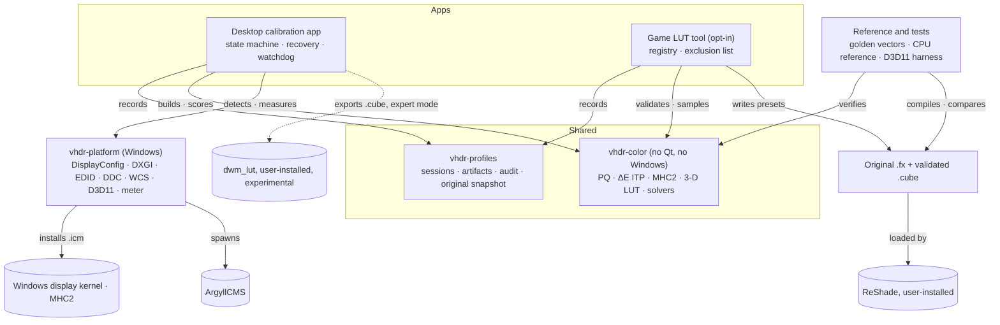

# ADR 0001: Split into modules carved out of this repository

- **Status:** Accepted
- **Date:** 11 September 2026
- **Decided at:** `reliability-and-usability-pass` @ `b450ff8`
- **Related:** [docs/ux-redesign.md](../ux-redesign.md)

## Decision

Split the project into modules carved out of this repository. Do not rewrite it, and do
not keep growing it as one application.

The code that already works moves behind clear boundaries: the colour maths, the
measurement engine, the Windows display layer and the watchdog. The two things the new
goals add, a 3-D LUT engine and a game path, are built new inside those boundaries.
The desktop app keeps applying exactly one kind of transform, through the one mechanism
Windows documents. This project never injects code into Windows or into games.

## Context

### The goals

| Goal | Verdict |
| --- | --- |
| A reliable desktop-wide 3-D LUT | Not reliably achievable; see below |
| Per-display 3-D LUT profiles | Achievable as management; applying them desktop-wide has the same limit |
| A safe, accurate, reversible desktop transform | Achievable after refactoring; MHC2 is reversible by nature |
| A safe 3-D LUT in games | Only through ReShade, installed by the user; single-player only |
| Per-game profiles and tone mapping | Profiles yes; tone mapping is mostly measured guidance |
| Honest HDR labelling | Achievable now; the code never synthesises HDR |
| Repeatable, auditable meter calibration | Achievable after a verification pass, repeat readings and provenance |
| Safe for normal users, deep for experts | Achievable after refactoring, by keeping the game path separate |

### The ceiling is Windows', not this code's

Windows exposes exactly one programmable display-wide transform: the MHC2 tag of an ICC
profile. The display kernel applies it as a 3x4 matrix in linear XYZ followed by three
1-D LUTs indexed by PQ code. Microsoft documents no application API for a 3-D LUT stage,
and a correction that depends on hue and saturation together has no representation in
that container at any LUT size.

Every way around MHC2 on the desktop is worse:

- **DWM injection** is what dwm_lut does. It is GPL-3.0, validates specific Windows
  builds, warns that any update may break it, and reaches composed surfaces only. Its
  GUI raises a click-through overlay over any LUT-active monitor covered by a fullscreen
  app, which keeps games on the composed path, so they lose Independent Flip.
- **Capture and re-present** adds at least a frame of latency, costs every fullscreen
  app Independent Flip and VRR, and blacks out protected content.
- **A virtual display** adds a signed driver to the same list.
- **GPU vendors** expose no public 3-D LUT API on Windows.

A new project in any language meets the same wall.

### The code is a sound foundation

Measured on 11 September 2026 at `e04ac57`, the package divides into three layers:

| Layer | Lines | Modules | Imports Qt | Imports Windows |
| --- | --- | --- | --- | --- |
| Colour and measurement | 4,266 | curves, delta_itp, gamma_correction, greyscale, icc, measure, model, patterns | No | Two imports, cut in Phase 2 |
| Windows platform | 2,519 | windows_api, hdr_display, edid, ddc, meter, elevation | No | Yes |
| UI and orchestration | 7,503 | app, pattern_view, measure_view, dialogs, controls, hotkeys, `__main__` | Yes | Yes |

The two crossings are `measure` importing `MeterError` and `Reading` from `meter`, and
`patterns` importing `SCRGB_WHITE_NITS` from `hdr_display`. The core's tests, 336 of
them, run in 2.3 seconds on a Python with nothing but the standard library installed.

The colour maths holds up when executed: the BT.2100 LMS rows behind the ΔE ITP figures
were re-derived and match, the LUT stays monotone across a 4,096-point sweep of every
control, and the PQ, sRGB and Bradford constants were checked against their
specifications. The measurement engine is proven on hardware: greyscale error went from
28.37% median to 2.79%, tracking intent to within 1-3% from 2.3 to 280 nits.

## Options considered

| Option | Verdict |
| --- | --- |
| A. Continue as is | Quickest first desktop result, but can never reach the 3-D goals, and every feature lands in the file that restores the display |
| B. Major refactor | The same work as D, shipped as one app that both writes into game folders and restores the desktop |
| C. New project | Re-derives code that is already verified, then meets the same Windows limits |
| **D. Split into modules** | **Chosen.** A shared core, the desktop app and a separate game tool, carved out of this repository |

D reuses every non-UI line except `ddc_tune`, the UI layout and all the tests. Its
extraction is mechanical and guarded by the fast core tests, an import-boundary test and
golden MHC2 digests, and the game tool cannot break the desktop app because it cannot
import it.

## Target architecture

- **vhdr-color** holds the eight core modules and a new 3-D LUT engine. It imports
  neither Qt nor Windows code.
- **vhdr-profiles** is a new versioned store for displays, measurement sessions,
  artifacts, assignments, an audit log and a write-once copy of what Windows had. It
  replaces four overlapping JSON files. `gamma_hotkeys.json` stays as the watchdog's
  contract.
- **vhdr-platform** is today's Windows layer. The game tool may read display identity
  from it but never change anything.
- **The desktop app** applies an MHC2 profile per display and per Windows mode, and one
  control reverses it. The MHC2 transport and the watchdog belong to it alone.
- **The game LUT tool** is separate, opt-in and off by default. An original ReShade
  effect applies a validated `.cube` in BT.2020 PQ. The user installs ReShade; this
  project never injects anything. Single-player titles only.
- **The dwm_lut export** sits behind expert mode and only writes a validated `.cube` and
  its metadata. The app never starts, stops or injects dwm_lut.

**Enforced by tests.** The core may import only the standard library and itself;
`tests/test_import_boundary.py` checks every import statement from source. When the game
tool exists, the same test will refuse either app importing the other.

**Providers, not plugins.** Display, colour transport, meter, pattern surface and game
host are Python protocols with in-repository implementations. Nothing loads third-party
modules at run time.

## Consequences

- This app will not apply a 3-D LUT to the desktop. "Desktop-wide 3-D LUT support" means
  MHC2 correction per display and per Windows mode, plus an experimental `.cube` export
  the user loads into dwm_lut themselves. While that is active, fullscreen games lose
  Independent Flip.
- In-game 3-D LUTs depend on ReShade: single-player titles, where the user installed it,
  verified per title. Anti-cheat and frame generation are outside what this project can
  control.
- "Meter-verified" becomes an earned label: a separate run with the profile active, in
  the same display state, with a named instrument and correction file, meeting stated
  ΔE ITP limits on the greyscale and white, with repeatability recorded.
- The two crossing imports and `ddc_tune`, a monitor-write path nothing calls, go in
  Phase 2.

## Scope of the first release

The first reliable release is the desktop app 2.0 on one display, plus the core. The
game tool ships separately as an experimental 0.x release.

| Boundary | First release |
| --- | --- |
| Supports | MHC2 correction per display and per Windows mode; measured greyscale and white on one display; restore to Windows' original profile; a bypass; `--safe`; a verification pass with a report; ArgyllCMS colorimeters with a recorded correction file; a gamut report |
| Not yet | A desktop 3-D LUT applied by the app; SDR-to-HDR conversion; desktop tone mapping; per-refresh profiles; mixed SDR and HDR monitors; any write to the monitor over DDC; automatic updates |
| Experimental | The game tool; the dwm_lut export; multiple monitors; exclusive fullscreen; Vulkan |
| Excluded | Any injection or hook by this project; multiplayer and anti-cheat titles; calibration cubes on SDR back buffers |

## Plan

A strangler extraction: fix in place, move with tests, then build the new parts inside
the new boundaries.

| Phase | Goal | Status |
| --- | --- | --- |
| 0 | Make today's app safe while the split happens | Done: `21346b6` to `e04ac57`; restore verified on hardware |
| 1 | This record, CI, the import-boundary test, a tagged `main`, and the Independent-Flip question | In progress |
| 2 | vhdr-color as a pure package, with golden vectors; the boundary test passes with no exceptions | |
| 3 | A `.cube` reader, validator and CPU samplers you can trust before any shader exists | |
| 4 | vhdr-profiles: the store, the audit log and recovery; profile file names unique per user | |
| 5 | The desktop app rebuilt on the new services, applying MHC2 only | |
| 6 | Faster, repeatable measurement able to cover the whole gamut | |
| 7 | Meter verification and reports | |
| 8 | The game LUT tool, proven end to end in one title | |
| 9 | A compatibility label per game, backed by evidence | |
| 10 | Public beta readiness | |
| 11 | Stable release gates | |

### Decisions the owner has made since

- **Phase 0 tone controls.** Contrast and Midtone Brightness fold into the SDR-in-HDR
  correction only while it is on. With it off they stay whole-range.
- **Per-user profile file names** moved from Phase 0 to Phase 4.
- **Code signing is out of scope.** Phase 10 goes ahead without it, and builds stay
  unsigned.

## Open questions

None of these would reverse the split; each would change its scope or order.

- **Does MHC2 reach Independent-Flip games?** It is inferred, not observed. Phase 1
  settles it with a PresentMon capture of the app's own pattern window and a tint test in
  one VRR HDR game, and records the answer in `docs/measurements/`.
- **Must this app itself apply a 3-D LUT to the desktop?** Assumed no. If in-house DWM
  injection were accepted, it would be a native component in its own process and
  release, labelled experimental.
- **Will there be a second display, GPU vendor or panel type?** That decides whether
  multi-monitor support and a "stable" label are reachable.
- **Which licence for the game effect?** GPL-3.0 like the app, or permissive so it can
  ship in shader packs.
- **Keep the name "Virtual HDR"?** The product never synthesises HDR.
- **The game effect's frame-time budget.** Assumed under 1 ms at 4K.

## Evidence

Every statement about hardware applies to one ASUS PG32UCDM (QD-OLED), one GPU and one
i1 DisplayPro driven by ArgyllCMS spotread 3.5.0, until a second configuration has been
measured. Sources: this repository at `b450ff8`; six code audits run on 10 September
2026; an import scan and test timings on 11 September; Microsoft's MHC2 and display
calibration documentation; the dwm_lut fork's README and GUI source as read on
4 September; ReShade's repository; ArgyllCMS's collink documentation; DisplayCAL's
release notes on SMPTE 2084 3-D LUTs. No third-party code was copied.
